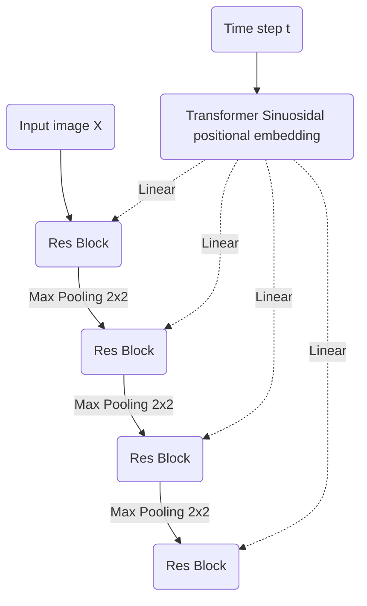

# DDPM Pytorch

Pytorch implementation of "Improved Denoising Diffusion Probabilistic Models"

## Configuration

Training run with hydra

## Flow

```mermaid
  graph TD;
      T(Time step t)-->B(Transformer Sinuosidal positional embedding);
      X(Input image X)-->R1(Res Block);
      B-.-> |Linear| R1;
      R1--> |Max Pooling 2x2| R2(Res Block);
      B-.-> |Linear| R2;
      R2--> |Max Pooling 2x2| R3(Res Block);
      B-.-> |Linear| R3;
      R3--> |Max Pooling 2x2| R4(Res Block);
      B-.-> |Linear| R4;

```
