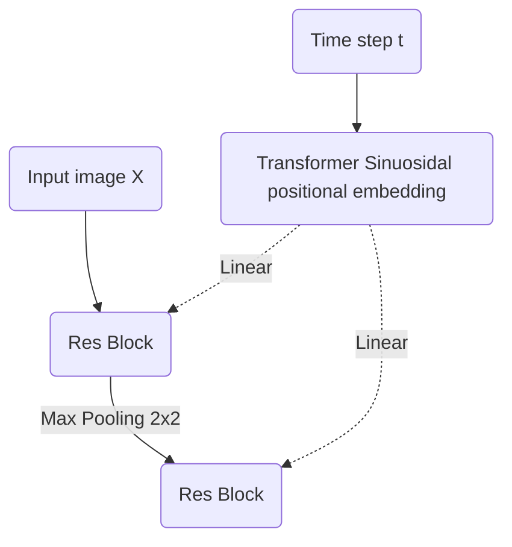

```mermaid
  graph TD;
      T(Time step t)-->B(Transformer Sinuosidal positional embedding);
      X(Input image X)-->R1(Res Block);
      B-.-> |Linear| R1;
      R1--> |Max Pooling 2x2| R2(Res Block);
      B-.-> |Linear| R2;
```
